# PhotonString
Laser Sound Visualization System
---

---
# General Description
**PhotonString** is a gesture-controlled optical synthesizer that converts hand motion into sound and real-time laser visuals. A handheld inertial controller maps orientation to musical pitch and octave, generating audio signals. These signals drive a dual-mirror laser system, where vibrating mirrors render Lissajous figures that directly visualize the sound’s frequency and phase. The system physically links motion, audio synthesis, and optics into a single analog-digital instrument.

---

## Bill of Materials (BOM)

### Controller Unit - Gesture Interface
▪ Microcontroller: 1 ESP32  
▪ IMU Sensor: MPU6050   
▪ Trigger Input: Button or Switch 
▪ Audio Output: 1 × speaker (Buzzer)  
▪ Enclosure: 3D-printed handheld chassis
▪ Power / Data Interface: USB or battery  

### Base Station - Optical Projection Core
▪ Microcontroller: 1 ESP32  
▪ Laser Source: 532 nm green diode  
▪ Mirror Actuators: 2 × mini speakers (≈3 W, 8 Ω)  
▪ Audio Output: 1 × speaker  
▪ Amplification: PAM8403 stereo amplifier  
▪ Reflective Elements: Ultra-light mirrors  
▪ Mechanical Mount: Orthogonal X/Y frame (90°)  
▪ Enclosure: Light-sealed optical chassis  

---

## Q1 - System Boundary

▪ Input domain: Human motion and discrete trigger events  
▪ Output domain: Audible sound and projected laser geometry (Lissajous figures)

All sensing, signal processing, actuation, and optical transformation
are contained within the system boundary.

---

## Q2 - Location of Intelligence

▪ Gesture interpretation  
▪ Pitch quantization  
▪ Temporal control (Delay due to the communication limitation i.e speed of transmission)  

All intelligence resides in the controller.
The projection system executes physical dynamics only (Hand movement & Mirror vibration by the frequency produced).

---

## Q3 - Primary Technical Challenge

▪ Synchronization between the frequency generator (the hand system) and the vibration of mirror (to sync the sound with the figures shown).  
▪ The vibration of mirror due to the low force ( ≈ 0.1 N ) produced by the audio speaker. Thereby we have to extend the distance necessary for the projection of our figures ( ≈ 10 cm in diameter / 6 m).  
 ▪ Gyroscope calibration (y-axis is the octave selector while the x-axis is the note generator).  

---

## Q4 - Minimum Viable Demonstration

▪ Controller tilt produces quantized pitch  
▪ Trigger initiates tone generation  
▪ Laser reflects from vibrating mirrors    

This establishes the full motion → sound → light pipeline.

---

## Q5 - Why This Is Not a Tutorial

▪ No predefined visual output  
▪ No deterministic rendering  
▪ No fixed performance state  

The system exhibits emergent behavior governed by
gesture, resonance, and analog dynamics.

---

## Microcontroller Selection - ESP32 Requirement

▪ 2 x ESP32: required for final system  

Reasons:
▪ higher timing resolution  
▪ improved audio generation  
▪ real-time filtering headroom  
▪ optional wireless operation  

PhotonString is a real-time cyber-physical instrument.
ESP32 provides the necessary control margin.

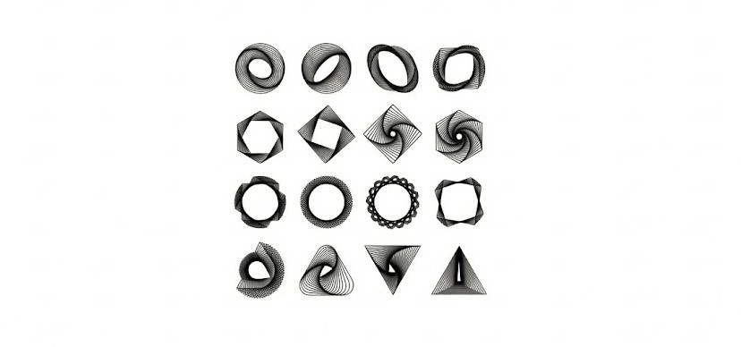

---

## Device Overview

The project relies on three custom hardware components working in tandem to generate sound from gestures and translate audio vibrations into visual laser patterns.

| **1. The Sound Source (Gesture Glove)** | **2. The Modulator Mechanism** | **3. The Laser Source** |
| :--- | :--- | :--- |
|  | 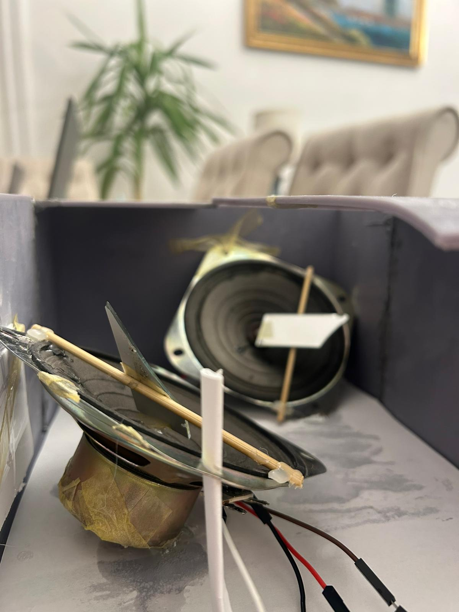 | 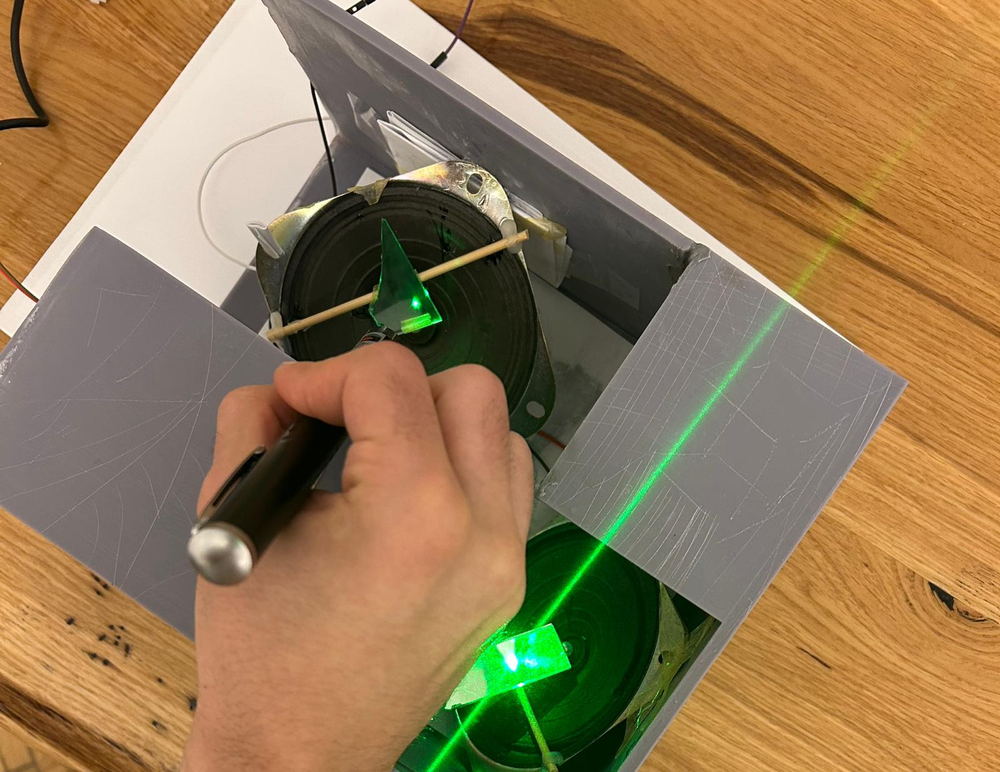 |
| A wearable "virtual violin" glove. It detects hand movements to generate musical notes and vibrations, acting as the audio input for the system. | The core component featuring a stretched membrane with a tiny mirror mounted on a flexible hinge. Audio vibrations cause the mirror to oscillate rapidly on multiple axes. | A focused green laser beam directed onto the modulator's mirror. The reflection creates the dynamic light patterns produced by the sound. |

---

# Lissajous Gallery 

  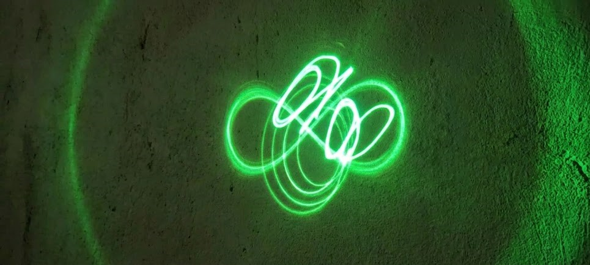

---

## Figures Created with our Device 

Here is a collection of sample light patterns generated by the device.

| | | | |
|:---:|:---:|:---:|:---:|
| **Figure 1** 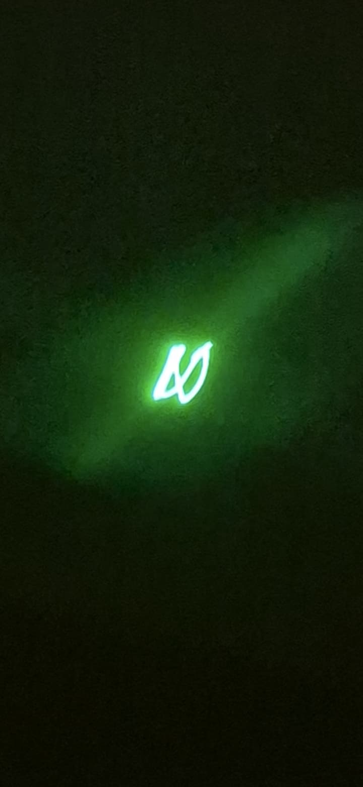 | **Figure 2** 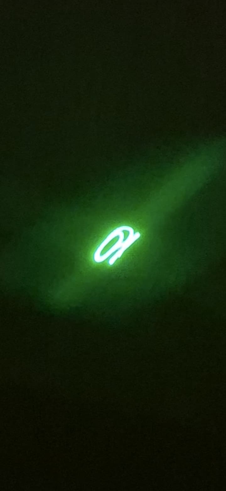 | **Figure 3** 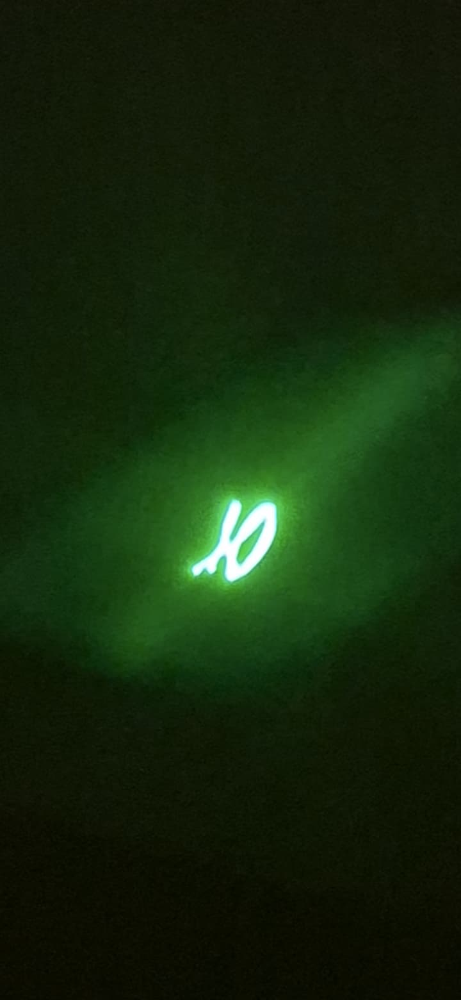 | **Figure 4** 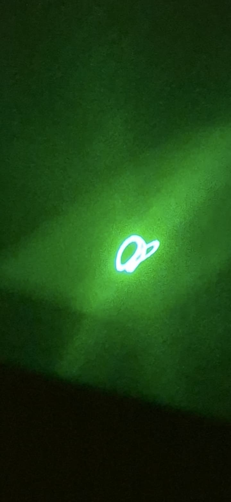 |
| **Figure 5** 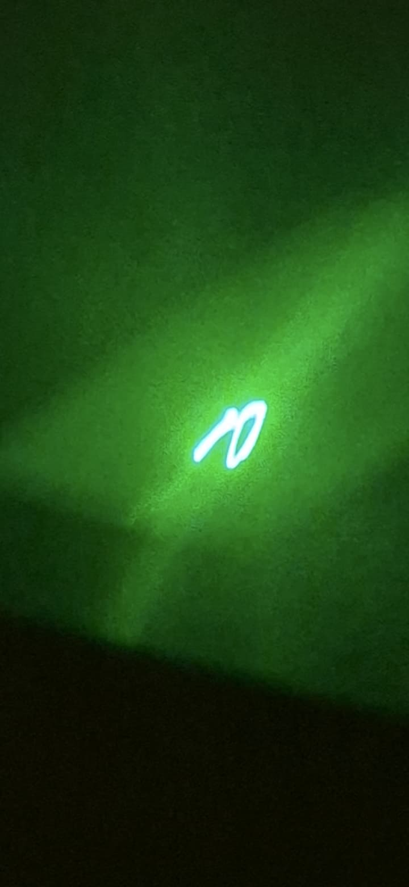 | **Figure 6** 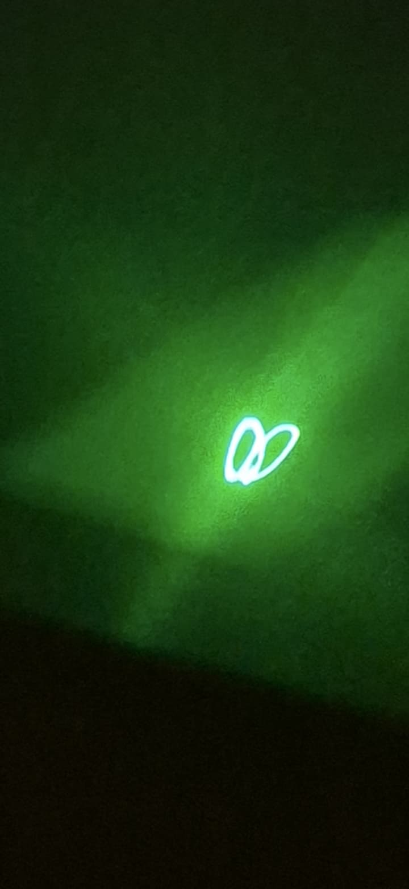 | **Figure 7** 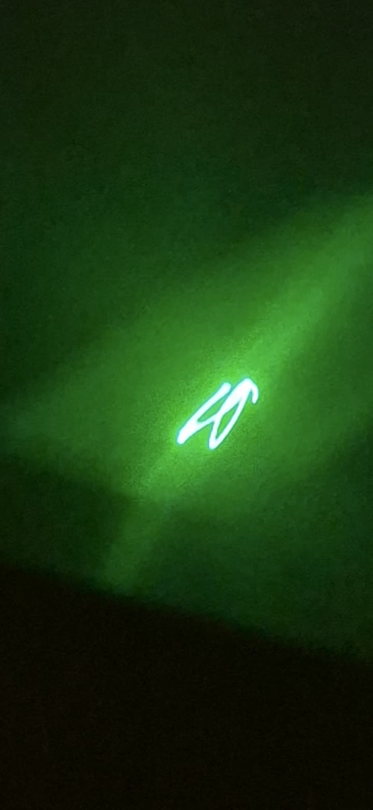 | **Figure 8** 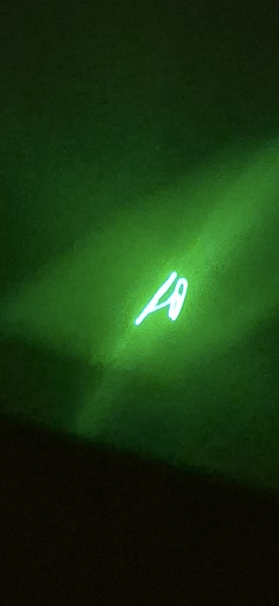 |
